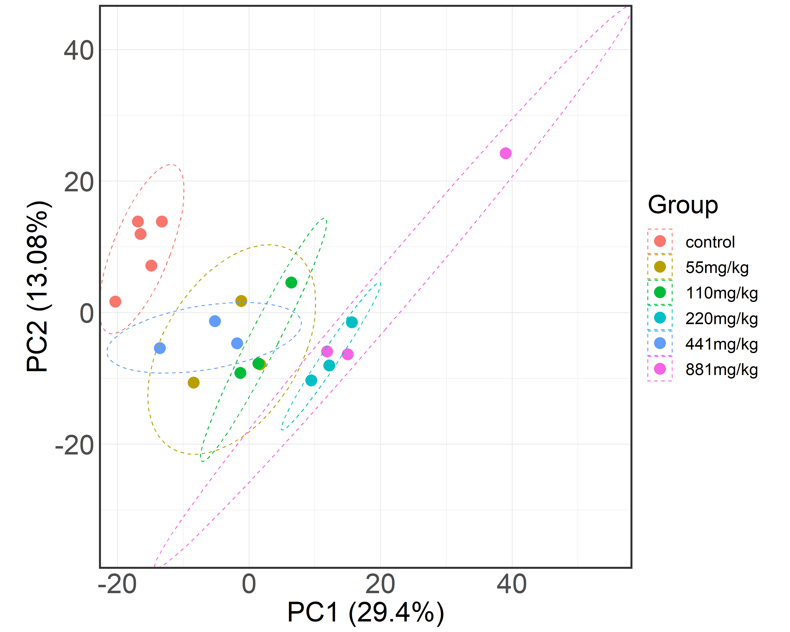

Tutorial for ToxDAR
================

A Workflow Software for Analyzing Toxicologically Relevant Proteomic and Transcriptomic Data, From Data Preprocessing to Toxicological Mechanism Elucidation.

Overview
--------

Exploration of toxicological mechanisms is imperative for the assessment of potential adverse reactions to chemicals and pharmaceutical agents, the engineering of safer compounds, and the preservation of public health.

High-throughput proteomics and transcriptomics can accurately capture the body's response to toxins and have become key tools for revealing complex toxicological mechanisms. Recently, a vast amount of omics data related to toxicological mechanisms has been accumulated. However, analyzing and utilizing this data remains a major challenge for researchers.

To address this, the current study has developed ToxDAR, a workflow-oriented R package for preprocessing and analyzing toxicological multi-omics data. ToxDAR integrates packages like NormExpression, DESeq2, and igraph, and utilizes R functions such as prcomp and phyper. It supports data preprocessing, quality control, differential expression analysis, functional analysis, and network analysis. ToxDAR’s architecture also includes five major categories of mechanism-related biological entities and details fifteen types of interactions among them, providing comprehensive knowledge annotation for omics data analysis results. 


Features
--------

**ToxDAR, designed to enhance the capabilities of data analysis and annotation, thereby improving the efficiency and quality of toxicological mechanism elucidation.**

-   ToxDAR is consisted of four main modules:
    - Data Preparation
    - Quality Control
    - Data Analysis
    - Data Interpretation


<br></br>

**The ToxDAR software package extracts associations and supporting evidence between toxicants and biological entities such as genes, pathways, and phenotypes from multiple knowledge bases.**

<table style="width:80%;">
<colgroup>
<col width="16%" />
<col width="20%" />
<col width="19%" />
</colgroup>
<thead>
<tr class="header">
<th>Source</th>
<th>Version</th>
<th>URL</th>
</tr>
</thead>
<tbody>
<tr class="odd">
<td>CTD</td>
<td>v2021-10</td>
<td>http://ctdbase.org/</td>
</tr>
<tr class="even">
<td>AOP-Wiki</td>
<td>v2022-12</td>
<td>https://aopwiki.org/</td>
</tr>
<tr class="odd">
<td>KEGG</td>
<td>v0.7.2</td>
<td>https://www.kegg.jp/</td>
</tr>
<tr class="even">
<td>DrugBank</td>
<td>v2020-12-15</td>
<td>https://go.drugbank.com/</td>
</tr>
<tr class="odd">
<td>DisGeNet</td>
<td>v7.0</td>
<td>https://www.disgenet.org/</td>
</tr>
<tr class="even">
<td>Disease Ontology</td>
<td>v2021-10-11</td>
<td>https://disease-ontology.org/</td>
</tr>
<tr class="odd">
<td>Human Phenotype Ontology</td>
<td>v2021-10-10</td>
<td>https://hpo.jax.org/app/</td>
</tr>
<tr class="even">
<td>PhosphoSitePlus</td>
<td>v6.6</td>
<td>https://www.phosphosite.org/</td>
</tr>
<tr class="odd">
<td>UbiBrowser</td>
<td>v2.0</td>
<td>http://ubibrowser.ncpsb.org.cn</td>
</tr>
<tr class="even">
<td>ENCODE</td>
<td>v120</td>
<td>https://www.encodeproject.org/</td>
</tr>
<tr class="odd">
<td>STRINGdb</td>
<td>v11.0</td>
<td>https://string-db.org/</td>
</tr>
</tbody>
</table>


Installation
------------

**Hardware requirements**
- PC with 8G RAM or above is recommended
- Passed test on Windows 10, Ubuntu 18.04.6, macOS 14.6

**Software requirements**
- Depends: R (>= 3.6.1)
- Imports: limma, gprofiler2, ComplexHeatmap, igraph, NormExpression


**Run in R session:**

``` r
install.packages("devtools")
install.packages("remotes")
devtools::install_github("TMCjp/ToxDAR")
```

If there's any problem during installation, please refer to <a href="#FAQ">FAQ</a>.

How to use
----------


#### Try the simplest run with default data
> To assist users in reproducing the results, we have integrated the sample data into the R package. This includes public transcriptome data from the L02 cell line following exposure to Triphenyl Phosphate (TPP). Users can load the data with a single command.

``` r
library(ToxDAR)
load(file = paste0(system.file(package = "ToxDAR"), '/extdata/genexp.rdata'))
```

#### Data Preparation
> We utilize the ToxDAR software package to normalize the transcriptome data post-TPP exposure using ten different methods, subsequently generating a report on the effects of normalization. These normalization methods are evaluated based on two metrics: AUCVC and mSCC, to select the appropriate normalization method.

``` r
### Apply ten different preprocessing methods
# Gather factor data for each preprocessing method
HG7.norfac <- gatherFactors(genexp, methods = "HG7")[, 1]
TC.norfac <- gatherFactors(genexp, method = "TC")[, 1]
ERCC.norfac <- gatherFactors(genexp, method = "ERCC")[, 1]
TN.norfac <- gatherFactors(genexp, method = "TN")[, 1]
CR.norfac <- gatherFactors(genexp, method = "CR")[, 1]
UQ.norfac <- gatherFactors(genexp, method = "UQ")[, 1]
NR.norfac <- gatherFactors(genexp, method = "NR")[, 1]
TMM.norfac <- gatherFactors(genexp, method = "TMM")[, 1]
DESeq.norfac <- gatherFactors(genexp, method = "DESeq")[, 1]
TU.norfac <- gatherFactors(genexp, method = "TU")[, 1]

### Compute AUCVC(Area Under the normalized Coefficient of Variation threshold Curve) for different preprocessing methods
cv_uniform1 <- gatherCVs(data = genexp, nonzeroRatio = 0.5,
                        NR = NR.norfac,
                        DESeq = DESeq.norfac,
                        TMM= TMM.norfac,
                        HG7 = HG7.norfac,
                        TC = TC.norfac,
                        ERCC = ERCC.norfac,
                        TN = TN.norfac,
                        CR = CR.norfac,
                        UQ = UQ.norfac,
                        TU= TU.norfac)

cv_uniform2 <- gatherCVs4Matrices(None= genexp, raw_matrix =genexp, nonzeroRatio=1);
cv_uniform <- rbind(cv_uniform1, cv_uniform2);

cv_uniform <- as.data.frame(cv_uniform)
cv_uniform$Cutoff <- as.numeric(cv_uniform$Cutoff)
cv_uniform$Counts <- as.numeric(cv_uniform$Counts)

### Plot Index of AUCVC
library(ggplot2)
png(file = "cv.png", res=300, width=(1200*4.17), height=(960*4.17))
plotCVs(cv_uniform, methods=c("None", "NR", "DESeq", "TMM", "HG7", "TC", "ERCC", "TN", "CR", "UQ", "TU"),
        legend.position=c(1.12, .48))
dev.off()
```

<br></br>


``` r
### Calculate Spearman’s Rank Correlation Coefficient for different preprocessing methods
spearman_corr1 <- gatherCors(data= genexp, cor_method="spearman",
                            NR = NR.norfac,
                            DESeq = DESeq.norfac,
                            TMM= TMM.norfac,
                            HG7 = HG7.norfac,
                            TC = TC.norfac,
                            ERCC = ERCC.norfac,
                            TN = TN.norfac,
                            CR = CR.norfac,
                            UQ = UQ.norfac,
                            TU = TU.norfac,
                            pre_ratio=1, lower_trim=0.2, upper_trim=0.6, rounds=10000)

spearman_corr2 <- gatherCors4Matrices(None= genexp, raw_matrix=genexp, cor_method="spearman",
                                      pre_ratio=1, lower_trim=0.2, upper_trim=0.6, rounds=10000)
spearman_corr <- rbind(spearman_corr1, spearman_corr2);

spearman_corr <- as.data.frame(spearman_corr)
spearman_corr$Value <- as.numeric(spearman_corr$Value)

### Calculate mSCC(median Spearman’s Rank Correlation Coefficient)
cor.medians <- getCorMedians(spearman_corr)

### Plot mSCC(median Spearman’s Rank Correlation Coefficient) results
# Save the plot as a high-resolution PNG file
png(file = "cor3.png", res=300, width=(1200*4.17), height=(960*4.17))
plotCors(spearman_corr, methods=c("None", "NR", "DESeq", "TMM", "HG7", "TC", "ERCC", "TN", "CR", "UQ", "TU"),
         legend.position=c(1.12, .48));
dev.off()

### Preprocess expression profiles using the normalized factor matrix
# Apply normalization using the specified factor matrix from the TU method
genexp <- getNormMatrix(data = genexp, norm.factors = TU.norfac)
```

<br></br>


#### Quality Control
> We generated PCA plots and violin plots of gene expression distribution for these datasets, allowing us to visually observe the variability both between different experimental groups and within the same group across samples.

``` r
### Plot the PCA to illustrate the variability between different experimental groups and individual samples within each group.
gi <- c(rep("control",5), rep("55mg/kg",3), rep("110mg/kg",3), 
        rep("220mg/kg",3), rep("441mg/kg",3), rep("881mg/kg",3))
pcaresult <- toxPCA(genexp, stype = gi, outpng = T)
```

<br></br>

``` r
### Create a violin plot to compare data distribution differences between groups
png(file = "toxVio.png", res=300, width=(1200*3), height=(960*3))
plotVio(genexp, stype = gi)
dev.off()
```

<br></br>


#### Data Analysis
> We utilized the differential analysis module of the ToxDAR software package to identify differentially expressed genes associated with TPP exposure at various concentrations and time points. Additionally, the integrated knowledge base within ToxDAR provided clear associations between differentially expressed genes and TPP exposure.

``` r
genexp <- genexp[, c(1:5, 18,19,20)]

### Perform differential expression analysis, considering the top 10,000 genes
gi <- c(rep("control",5), rep("881mg/kg",3))
diffmat <- diffexp(genexp, groupinfo = gi, ntop = 10000)

### Annotate differential expression results with toxin information
annomat <- diffanno(diffmat, org = "rnorvegicus", toxid = 'C005445')
### Generate an interactive table from the annotated results
IntTab(diffres = annomat, outhtml = T)

### Create a volcano plot to visualize genes associated with the analyzed toxin
library(dplyr)
png(file = "volanno.png", res=300, width=(960*3), height=(1000*3))
volanno(diffres = annomat, nodesize = 1.5, annosize = 5, themsize = 24, legend.position = c(0.82, 0.15), legend.size = 12)
dev.off()
```

<br></br>

> To gain a comprehensive understanding of the functions of these genes, we proceeded to perform enrichment analysis on the differentially expressed genes following TPP exposure using multiple annotation datasets including GO, DO, KEGG, and others collected within the software package.
``` r
library(clusterProfiler)
# load data
gsy <- annomat$Symbol[1:30]
gis <- gconvert(query = gsy, organism = "hsapiens",
                target="ENTREZGENE_ACC", mthreshold = Inf, filter_na = TRUE)
gis <- gis$target

### Perform functional enrichment analysis using GO terms
# The 'slim' parameter specifies the type of ontology (GO/Kegg/DO)
gomat <- gofact(genes = gis, slim = 'go')

### Generate a bar plot of the top 10 functional categories
png(file = "funcbar.png", res=300, width=(1200*3), height=(960*3))
p <- plotfact(gomat, ntop = 10, fillby = "Pval", tn = 30, collimit = c(0, 0.05), xtextsize = 20, stripsize = 18)
p + theme(axis.text = element_text(size=20), axis.title = element_text(size=30), 
          legend.text = element_text(size=20), legend.title = element_text(size=30), legend.key.size = unit(20, "pt"),
          axis.ticks = element_blank())
dev.off()
```

<br></br>


``` r
# Filter for Biological Process (BP) terms from the enrichment results
tys <- unlist(lapply(gomat$hie, function(x) strsplit(x, '.', fixed = T)[[1]][1]))
bpmat <- gomat[which(tys == 'BP'), ]

# Generate a chord diagram for the top 5 biological processes
png(file = "funcchord.png", res=300, width=(2200*3), height=(2000*3))
plotexpfunc(bpmat, ntop = 5, diffresult = annomat, plottype = 'chord', chord.space = 0.05, gene.space = 0.25, gene.size = 9, process.title = 30, process.label = 28, termcol = 3)
dev.off()

# Generate a cluster plot for the top 5 biological processes
png(file = "funccluster.png", res=300, width=(1200*3), height=(1200*3))
plotexpfunc(bpmat, ntop = 5, diffresult = annomat, plottype = 'cluster')
dev.off()
```

<br></br>

<br></br>


> The ssGSEA method quantifies changes in gene expression profiles as a result of toxic exposure into the activation or inhibition states of biological pathways, revealing the mechanisms by which the organism responds to exposure at a molecular level. The changes are presented visually through enrichment plots and heatmaps for intuitive representation.
``` r
# Remove rows with missing gene symbols
nn <- which(is.na(annomat$Symbol))
gseamat <- annomat[-nn, ]

geneList <- gseamat$logFC
genename <- gseamat$Symbol

library(org.Hs.eg.db)
gid <- mapIds(org.Hs.eg.db, keys=genename, column="ENTREZID", keytype="SYMBOL", multiVals = "first")
names(geneList) <- gid

geneList <- geneList[order(geneList, decreasing = T)]

# Perform GSEA analysis using KEGG terms
gsearesult <- gseafc(geneList, term = "KEGG", minGSSize = 5, maxGSSize = 500)

# Plot GSEA results for 'Apoptosis' term
gsid <- gsearesult$gs_id[which(gsearesult$gs_description == 'Apoptosis')]
png(file = "gsea_up2.png", res=300, width=(1200*3), height=(960*3))
plotgsea(gsid, geneList, term = "KEGG")
dev.off()
```

<br></br>


``` r
# Extract Enrichment Scores (ES) and convert to matrix
esmicro <- as.matrix(gsearesult[, 'ES'])
rownames(esmicro) <- gsearesult$gs_exact_source

# Plot the ES heatmap without normalization
ESheatmap(esmicro, Normalization = F)
```

<br></br>


#### Data Interpretation
> We employed the ToxDAR network analysis and annotation module to map the associations between the toxin and key molecules, biological pathways, and phenotypes. Within this network, TPP is linked with biological pathways such as apoptosis and inflammatory responses, indicating that triphenyl phosphate (TPP) may act as a potential endocrine disruptor. It exerts its effects by activating the thyroid hormone receptor β (THRB) molecule, thereby influencing signaling pathways related to apoptosis and inflammatory responses, ultimately adversely affecting thyroid function. 

``` r
### Perform network analysis and annotation to map associations between the toxin and key molecules, biological pathways, and phenotypes.
netmat <- netmoa(toxid = 'C005445', ngid = gis, toppathway = 30, ppiscore = 500)

### Uncomment the following lines to generate and save a static PNG plot of the network
# png(file = "netmoa.png", res=600, width=(1600*5), height=(1200*5))
# netplot(netmoa = netmat)
# dev.off()

### Create and Save Interactive Network Visualization
nethtml <- netplothtml(netmoa = netmat, outtype = 'pdf')
savehtml(network = nethtml, htmlfile = 'netmoa.html')
```

<br></br>


FAQ
---

If `devtools::install_github()` raise `Installation failed: Problem with the SSL CA cert (path? access rights?)` error, try:

``` r
install.packages(c("curl", "httr"))
```

During installation there may be some configuration error (lack of libraries):

``` pre
------------------------- ANTICONF ERROR ---------------------------
Configuration failed because libcurl was not found. Try installing:
 * deb: libcurl4-openssl-dev (Debian, Ubuntu, etc)
 * rpm: libcurl-devel (Fedora, CentOS, RHEL)
 * csw: libcurl_dev (Solaris)
If libcurl is already installed, check that 'pkg-config' is in your
PATH and PKG_CONFIG_PATH contains a libcurl.pc file. If pkg-config
is unavailable you can set INCLUDE_DIR and LIB_DIR manually via:
R CMD INSTALL --configure-vars='INCLUDE_DIR=... LIB_DIR=...'
--------------------------------------------------------------------
```

Just follow the instruction to satisfy the dependencies. For instance, you can run `sudo apt-get install libcurl4-openssl-dev` in *Ubuntu* to fix the problem above.

> ToxDAR is developed using the R programming language and integrates numerous commonly used packages provided by Bioconductor, so if you get `'BiocInstaller' must be installed to install Bioconductor packages.`, please choose `1 (Yes)`. Since then you may see `Installation failed: cannot open the connection to 'https://bioconductor.org/biocLite.R'`, run `source('http://bioconductor.org/biocLite.R')`, finally try the installation commands above again.

> Please wait for minutes then **try again** if solving some dependencies from *GitHub* fails with `Connection timed out after 100001 milliseconds`.

License
-------

This package is free and open source software, licensed under [GPL v3.0](LICENSE).
